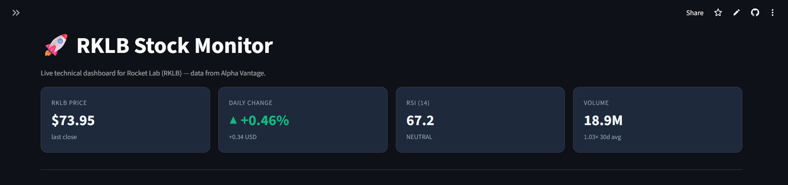
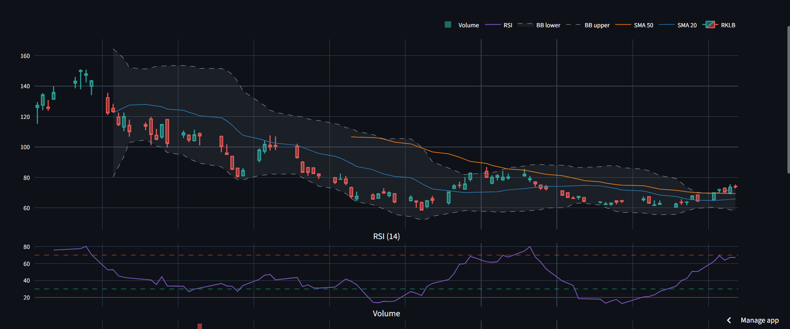
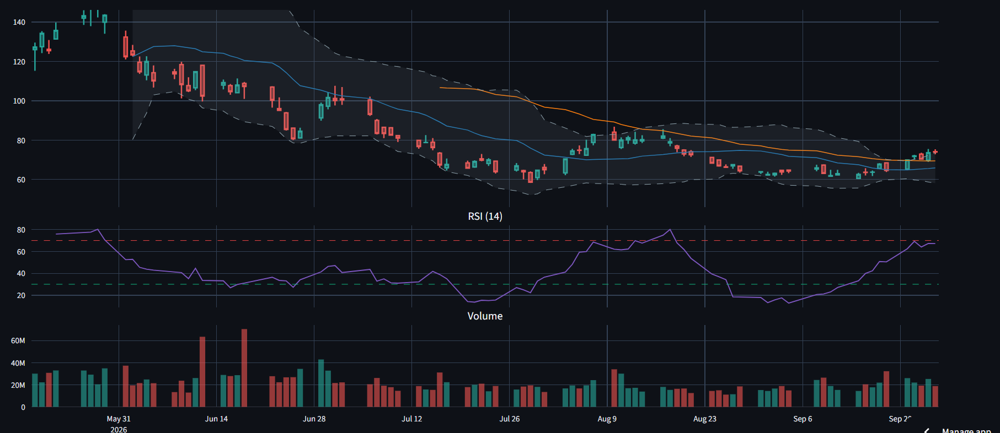

# 🚀 RKLB Stock Monitor

An automated Python tool that tracks **Rocket Lab (RKLB)** stock with live candlestick charts, technical indicators, and interactive dashboards — using real market data from the Alpha Vantage API.

**🔗 [Try it live](https://rklb-monitor-vinhais10.streamlit.app)**

## 📊 Screenshots

### Dashboard — KPIs and main chart

### Full chart — candlesticks, RSI, and volume

### Recent data table

## 📌 What This Does

Rocket Lab is a publicly traded space company (NASDAQ: RKLB). Tracking its price action manually is slow and error-prone. This project automates the entire process:

- Fetches real daily OHLCV data from Alpha Vantage
- Computes technical indicators (RSI, SMA, VWAP, Bollinger Bands)
- Renders an interactive dashboard with candlestick charts, RSI panel, and volume
- Optionally sends automatic Telegram alerts for RSI overbought/oversold and price moves >= 5%

## ✨ Features

- **Real market data** — daily OHLCV from the Alpha Vantage API
- **Interactive dashboard** — dark theme with KPI cards and Plotly charts
- **Candlestick chart** with 20-day and 50-day SMAs
- **Bollinger Bands** with fill between upper/lower bounds
- **RSI (14-period) panel** with overbought/oversold reference lines
- **Volume panel** synced to the price chart
- **Ticker input** — switch symbols directly from the sidebar
- **Lookback slider** — choose 30, 90, 180, or 365 days
- **Recent data table** — last 10 trading days with all indicators
- **Telegram bot** (optional) — /price, /chart, and /help commands
- **Automatic alerts** — RSI crosses and 5%+ daily moves
- **Unit tests** for indicator calculations
- **Graceful error handling** — API limits and network issues don't crash the app

## 🛠️ Tech Stack

- **Python 3.11** — core language
- **pandas** — data manipulation
- **Plotly** — interactive charts
- **Streamlit** — dashboard UI
- **Alpha Vantage API** — market data source
- **python-telegram-bot** (optional) — Telegram integration
- **pytest** — unit tests

## 🚀 Setup

### 1. Clone this repository

    git clone https://github.com/Vinhais10/RKLB-stock-monitor.git
    cd RKLB-stock-monitor

### 2. Install dependencies

    py -m pip install -r requirements.txt

### 3. Get a free Alpha Vantage API key

Go to https://www.alphavantage.co/support/#api-key and request a free key.

### 4. Create your .env file

Copy .env.example to .env and add your key:

    API_KEY=your_alphavantage_api_key_here

### 5. Run the dashboard

    py -m streamlit run app.py

The dashboard opens at http://localhost:8501

## 📁 Project Structure

    RKLB-stock-monitor/
    ├── app.py                    # Streamlit dashboard
    ├── stocks.py                 # Core logic: data + technical indicators
    ├── telegram_bot.py           # Optional Telegram bot
    ├── test_rsi_functions.py     # Unit tests for indicators
    ├── config.py                 # Local API keys (gitignored)
    ├── config_template.py        # Template for config
    ├── requirements.txt
    ├── .env.example              # Template for environment variables
    ├── .gitignore
    └── README.md

## 🧠 Technical Indicators

### RSI (Relative Strength Index)

Measures momentum on a 0-100 scale.

- < 30 — Oversold (potential buy signal)
- 30-70 — Neutral
- > 70 — Overbought (potential sell signal)

### SMA (Simple Moving Average)

Two periods displayed:

- **SMA 20** (blue) — short-term trend
- **SMA 50** (orange) — medium-term trend

When SMA 20 crosses above SMA 50 = golden cross (bullish).
When SMA 20 crosses below SMA 50 = death cross (bearish).

### Bollinger Bands

20-day SMA +/- 2 standard deviations. Price near the upper band signals strength; near the lower band signals weakness.

### VWAP (Volume-Weighted Average Price)

Average price weighted by volume — used by traders to gauge whether price is trading above or below fair value.

## 📤 Example Output

| Date | Open | High | Low | Close | Volume | RSI |
|---|---|---|---|---|---|---|
| 2026-09-25 | 74.15 | 75.32 | 72.78 | 73.95 | 18.9M | 67.21 |
| 2026-09-24 | 69.78 | 75.46 | 68.92 | 73.61 | 25.3M | 67.34 |
| 2026-09-23 | 72.87 | 73.57 | 70.08 | 70.31 | 19.3M | 64.04 |
| 2026-09-22 | 71.64 | 72.50 | 70.10 | 71.98 | 22.0M | 69.22 |

## 🗺️ Roadmap

- [x] Real OHLCV data from Alpha Vantage
- [x] Technical indicators (RSI, SMA, VWAP, Bollinger)
- [x] Candlestick chart with overlays
- [x] Telegram bot with /price, /chart, /help
- [x] Automatic RSI and price-move alerts
- [x] Unit tests for indicators
- [x] Interactive Streamlit dashboard
- [x] Deploy to Streamlit Cloud
- [ ] Multi-ticker watchlist
- [ ] Backtesting engine
- [ ] MACD indicator
- [ ] Email alerts
- [ ] Comparison with peers (AST SpaceMobile, Firefly, etc.)

## 🤝 Contributing

Pull requests are welcome. For major changes, please open an issue first.

## 📄 License

This project is licensed under the MIT License.

## 🙏 Acknowledgements

- Alpha Vantage (https://www.alphavantage.co/) for the free market data API
- Streamlit (https://streamlit.io/) for the dashboard framework
- Plotly (https://plotly.com/) for the interactive charts

---

Built as part of a self-directed Python learning project, applying real-world data analysis to financial markets.
